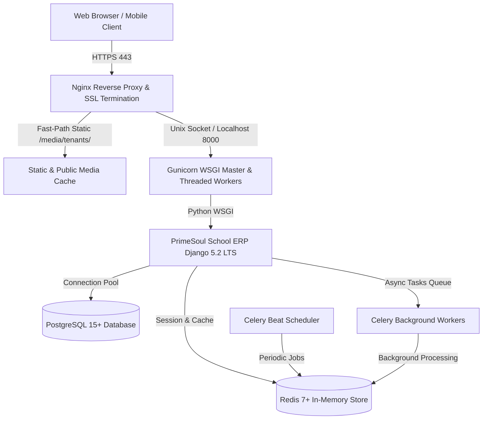

# PrimeSoul School ERP — Production Deployment Guide

**Product**: PrimeSoul School ERP  
**Company**: PrimeSoul Web Solutions  
**Document Version**: 5.0 (Production Release)  
**Target Environment**: Ubuntu 22.04 / 24.04 LTS, PostgreSQL 15+, Redis 7+, Python 3.11+, Nginx  

---

## 1. System Architecture Overview



---

## 2. Server Provisioning & Prerequisites

### 2.1 OS Package Installation
```bash
sudo apt update && sudo apt upgrade -y
sudo apt install -y python3.11 python3.11-venv python3.11-dev \
    postgresql postgresql-contrib libpq-dev \
    redis-server nginx git curl certbot python3-certbot-nginx \
    build-essential libjpeg-dev zlib1g-dev libffi-dev
```

### 2.2 PostgreSQL Database Provisioning
```bash
sudo -u postgres psql
```
```sql
CREATE DATABASE primesoul_erp;
CREATE USER primesoul_user WITH PASSWORD 'StrongProductionPassword123!';
ALTER ROLE primesoul_user SET client_encoding TO 'utf8';
ALTER ROLE primesoul_user SET default_transaction_isolation TO 'read committed';
ALTER ROLE primesoul_user SET timezone TO 'Asia/Kolkata';
GRANT ALL PRIVILEGES ON DATABASE primesoul_erp TO primesoul_user;
\q
```

---

## 3. Application Deployment & Environment Setup

### 3.1 Code Checkout & Virtualenv
```bash
sudo mkdir -p /var/www/primesoul
sudo chown -R $USER:www-data /var/www/primesoul
git clone https://github.com/PrimeSoul/Django-School-Management.git /var/www/primesoul
cd /var/www/primesoul

python3.11 -m venv venv
source venv/bin/activate
pip install --upgrade pip
pip install -r requirements.txt
```

### 3.2 Environment Configuration
Create `/var/www/primesoul/envs/.env` from `.env.example`:
```bash
cp .env.example envs/.env
chmod 600 envs/.env
# Edit secrets, DATABASE_URL, and ALLOWED_HOSTS
nano envs/.env
```

### 3.3 Database Migrations & Static Files
```bash
export DJANGO_SETTINGS_MODULE=config.settings.production
python manage.py migrate
python manage.py collectstatic --noinput
python manage.py check --deploy
```

---

## 4. Service Daemon Configuration

### 4.1 Nginx Setup
```bash
sudo cp deploy/nginx/primesoul.conf /etc/nginx/sites-available/primesoul.conf
sudo ln -s /etc/nginx/sites-available/primesoul.conf /etc/nginx/sites-enabled/
sudo nginx -t
sudo systemctl reload nginx
```

### 4.2 Systemd Services Setup
```bash
sudo cp deploy/systemd/primesoul-gunicorn.service /etc/systemd/system/
sudo cp deploy/systemd/primesoul-celery.service /etc/systemd/system/
sudo cp deploy/systemd/primesoul-celery-beat.service /etc/systemd/system/

sudo systemctl daemon-reload
sudo systemctl enable --now primesoul-gunicorn
sudo systemctl enable --now primesoul-celery
sudo systemctl enable --now primesoul-celery-beat
```

### 4.3 SSL Certificate Generation (Let's Encrypt)
```bash
sudo certbot --nginx -d primesoul.edu.in -d "*.primesoul.edu.in"
```

---

## 5. Verification & Health Monitoring

Verify all service statuses:
```bash
sudo systemctl status primesoul-gunicorn
sudo systemctl status primesoul-celery
sudo systemctl status primesoul-celery-beat
curl -I https://primesoul.edu.in/health/
curl -s https://primesoul.edu.in/health/ready/ | jq .
```
