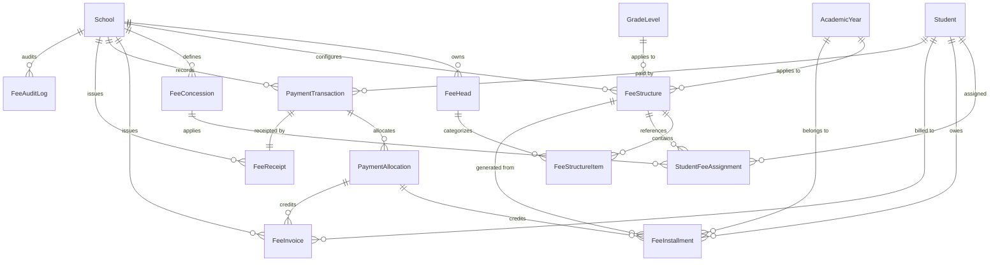
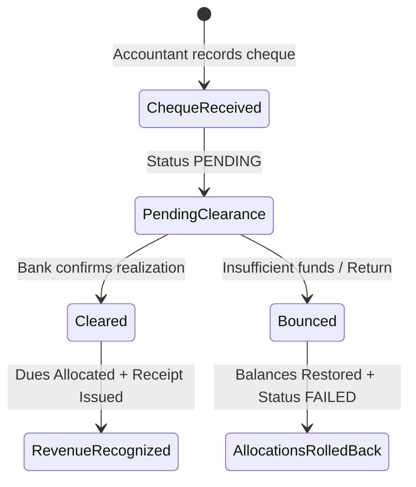

# PrimeSoul School ERP - Fees & Financial Management Architecture (Phase 3)

**Author:** PrimeSoul Web Solutions  
**Status:** Production-Ready Architecture (Phase 3)  
**Target Market:** Indian K-12 Schools (CBSE, ICSE, State Boards) & Multi-Branch Institutions  

---

## 1. Executive Summary

Phase 3 introduces a robust, multi-tenant Indian K-12 Fee and Financial Management subsystem to **PrimeSoul School ERP**. It provides deterministic monetary calculation (`Decimal` arithmetic in `INR`), support for multi-head fee structures, automated quarterly/monthly installment generation (April–March session), configurable concessions (percentage, fixed amount, full waivers), sequential concurrency-safe invoice and receipt generation, comprehensive offline payment recording (with cheque clearance and bounce lifecycle), and server-side verified online payment integration (Razorpay orders, HMAC SHA256 signatures, and idempotent webhooks).

---

## 2. Core Domain Models & Relationships

### Model Specifications

1. **`FeeHead`**:
   - Categorized fee components: `TUITION`, `ADMISSION`, `ANNUAL`, `DEVELOPMENT`, `COMPUTER`, `LAB`, `ACTIVITY`, `EXAM`, `TRANSPORT`, `LIBRARY`, `HOSTEL`, `OTHER`.
   - Tenant isolation constraint: `UniqueConstraint(fields=['school', 'code'])`.

2. **`FeeStructure` & `FeeStructureItem`**:
   - Master structure per `(school, academic_year, grade_level, name)`.
   - Frequency: `MONTHLY`, `QUARTERLY`, `HALF_YEARLY`, `ANNUAL`, `CUSTOM`.
   - Line items define `fee_head`, `amount` (`DecimalField(max_digits=12, decimal_places=2)`), `mandatory`, and `due_day`.

3. **`FeeConcession`**:
   - Concession rules: `PERCENTAGE`, `FIXED_AMOUNT`, `FULL_WAIVER`.
   - Supports sibling discount, merit scholarships, staff ward, EWS/RTE, and management quotas.
   - Includes optional ceiling cap `maximum_amount`, date validity windows, and principal approval workflows.

4. **`StudentFeeAssignment`**:
   - Links a student to a `FeeStructure` and optional `FeeConcession` for an academic year.
   - Unique constraint: `UniqueConstraint(fields=['student', 'academic_year', 'fee_structure'])`.

5. **`FeeInstallment`**:
   - Installment breakdown (e.g. Q1 Apr–Jun, Q2 Jul–Sep, Q3 Oct–Dec, Q4 Jan–Mar).
   - Tracks `base_amount`, `concession_amount`, `late_fee`, `payable_amount`, `paid_amount`, and `balance_amount`.
   - Statuses: `PENDING`, `PARTIAL`, `PAID`, `OVERDUE`, `WAIVED`, `CANCELLED`.

6. **`FeeInvoice`**:
   - Formal invoice with sequential per-school numbering (`INV-YYYY-XXXXX`).
   - Tracks `subtotal`, `concession`, `late_fee`, `total`, `paid_amount`, `balance_amount`, and `status`.

7. **`PaymentTransaction`**:
   - Immutable financial transaction record.
   - Modes: `CASH`, `CHEQUE`, `UPI`, `CARD`, `NET_BANKING`, `RAZORPAY`, `OTHER`.
   - Statuses: `INITIATED`, `PENDING`, `SUCCESS`, `FAILED`, `REFUNDED`, `CANCELLED`.
   - Offline Cheque tracking: `cheque_number`, `bank_name`, `cheque_date`, `clearance_status` (`PENDING`, `CLEARED`, `BOUNCED`), `cleared_at`.

8. **`PaymentAllocation`**:
   - Atomic link distributing a payment's amount across one or multiple installments and invoices.
   - Guarantees: $\sum \text{allocated\_amount} \le \text{payment.amount}$ and $\text{allocated\_amount} \le \text{due.balance}$.

9. **`FeeReceipt`**:
   - Sequential receipt numbering (`RCP-YYYY-XXXXX`) per school tenant.
   - Stores payment mode, fee heads breakdown, authorized signature block, and tamper-evident QR verification string.
   - Auto-generates downloadable PDF via ReportLab.

10. **`FeeAuditLog`**:
    - Append-only immutable ledger recording actor, action, model, object ID, timestamp, before/after state diffs, and IP address.

---

## 3. Financial Calculation Rules & Formulas

### 3.1 Concession Calculation

$$\text{Discount} = \begin{cases} 
\text{Base Amount} & \text{if Full Waiver} \\
\min\left(\frac{\text{Base Amount} \times \text{Percentage}}{100}, \text{Cap}\right) & \text{if Percentage} \\
\min(\text{Base Amount}, \text{Fixed Amount}) & \text{if Fixed Amount}
\end{cases}$$

$$\text{Payable Amount} = \max(0.00, \text{Base Amount} - \text{Discount})$$

*Negative payable amounts are strictly prohibited at both model and service layers.*

### 3.2 Indian Academic Year Installments (April–March)

* **Quarterly Schedule**:
  * **Q1 (Apr – Jun)**: Due April 10th
  * **Q2 (Jul – Sep)**: Due July 10th
  * **Q3 (Oct – Dec)**: Due October 10th
  * **Q4 (Jan – Mar)**: Due January 10th
* **Monthly Schedule**: 12 monthly installments due on the 10th of each month (April through March).

---

## 4. Payment Lifecycle & Workflows

### 4.1 Offline Cheque Lifecycle

### 4.2 Online Razorpay Workflow

1. **Order Creation**: Server generates `razorpay_order_id` and registers `PaymentTransaction(status=INITIATED)`.
2. **Payment Collection**: Parent completes checkout on client.
3. **Server-Side Verification**:
   - Verifies HMAC SHA256 signature using `RAZORPAY_KEY_SECRET`.
   - Never trusts client-side redirect status or amounts.
   - Transitions `PaymentTransaction` to `SUCCESS`, invokes `auto_waterfall_allocation`, and generates `FeeReceipt`.
4. **Idempotent Webhooks**:
   - Validates webhook signature using `RAZORPAY_WEBHOOK_SECRET`.
   - Deduplicates repeated webhook deliveries to prevent double-crediting.

---

## 5. Role-Based Access Control (RBAC)

| Role | Fee Structures | Invoices | Collect Payments | Clear / Bounce Cheques | Approve Concessions | View Own Fees |
|---|:---:|:---:|:---:|:---:|:---:|:---:|
| **School Admin** | Full | Full | Yes | Yes | Yes | All |
| **Principal** | Read | Read | View | View | Yes | All |
| **Accountant** | Full | Full | Yes | Yes | No | All |
| **Receptionist** | Read | View | Yes (Permitted) | No | No | School |
| **Teacher** | None | None | None | None | None | None |
| **Parent** | None | None | Online Only | None | None | Own Children |
| **Student** | None | None | None | None | None | Own Records |

---

## 6. REST API Endpoints (`/api/v1/fees/`)

| Endpoint | Method | Description |
|---|---|---|
| `/api/v1/fees/fee-heads/` | GET, POST, PUT, DELETE | Manage school fee categories & heads |
| `/api/v1/fees/fee-structures/` | GET, POST, PUT, DELETE | Grade-level fee structures & items |
| `/api/v1/fees/concessions/` | GET, POST, PUT, DELETE | Concession rules |
| `/api/v1/fees/concessions/{id}/approve/` | POST | Principal/Admin concession approval |
| `/api/v1/fees/student-fees/` | GET, POST, PUT, DELETE | Assign structures to students |
| `/api/v1/fees/student-fees/generate_installments/` | POST | Bulk installment generation |
| `/api/v1/fees/installments/` | GET | List student installments (tenant/parent filtered) |
| `/api/v1/fees/invoices/` | GET, POST | Fee invoice management |
| `/api/v1/fees/invoices/{id}/cancel/` | POST | Cancel unpaid invoice |
| `/api/v1/fees/payments/` | GET | Transaction ledger |
| `/api/v1/fees/payments/collect_offline/` | POST | Record Cash/Cheque/POS/UPI payment |
| `/api/v1/fees/payments/{id}/clear_cheque/` | POST | Mark cheque cleared & credit dues |
| `/api/v1/fees/payments/{id}/bounce_cheque/` | POST | Mark cheque bounced & rollback |
| `/api/v1/fees/payments/initiate_razorpay_order/` | POST | Create server-side payment order |
| `/api/v1/fees/payments/verify_razorpay_payment/` | POST | Verify HMAC signature & complete |
| `/api/v1/fees/receipts/` | GET | Receipt history |
| `/api/v1/fees/receipts/{id}/download_pdf/` | GET | Download PDF fee receipt |
| `/api/v1/fees/dashboard/` | GET | High-performance aggregate financial metrics |
| `/api/v1/fees/webhooks/razorpay/` | POST | Razorpay webhook listener |

---

## 7. Asynchronous Celery Tasks

* `check_overdue_installments_task`: Periodic scheduled task marking past-due installments as `OVERDUE`.
* `generate_bulk_invoices_task`: Asynchronously generates invoices across grades/classes.
* `generate_receipt_pdf_task`: Asynchronous receipt rendering and storage.
* `send_fee_reminder_task`: Parent SMS/WhatsApp/Email payment reminders.
